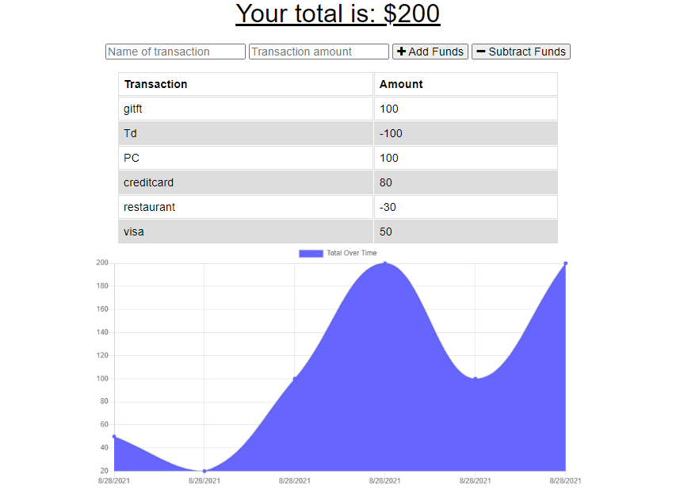
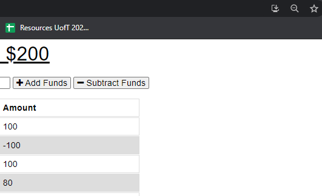

# Budget Tracker
  

## Description
A simple budget tracker progressive web application that works offline and can be downloaded to your desktop or mobile device.
            
View the deployed page at [Budget Tracker](abc).

## Contents
* [Installation](#Installation)
    * [Technologies](#Technologies)
* [Usage](#Usage)
   * [Screenshots](#Screenshots)
* [Questions](#Questions)
* [Credits](#Credits)

## Installation
To start using this repository, clone the repo and run `npm i` in the command line to install dependencies.  Run `npm start` to start the Express.js server on `localhost:3001`.
    
## Usage
To use the budget tracker, simply provide a transaction name and transaction amount, then click "add funds" or "subtract funds".  To download the application to your desktop, click on the "Install Budget Tracker" icon found in the right-hand side of the address bar of your Google Chrome browser.
    
### Screenshots

## Questions
If you have any questions about the repo, please [open an issue](https://github.com/krutipatel07/PWA-Budget-Tracker/issues) or contact me via email at kruti.patel0709@gmail.com. You can find more of my work on my GitHub, [kruti](https://github.com/krutipatel07/).
    
## Credits
* [UCF Coding Boot Camp Starter Code](https://github.com/coding-boot-camp/symmetrical-bassoon)